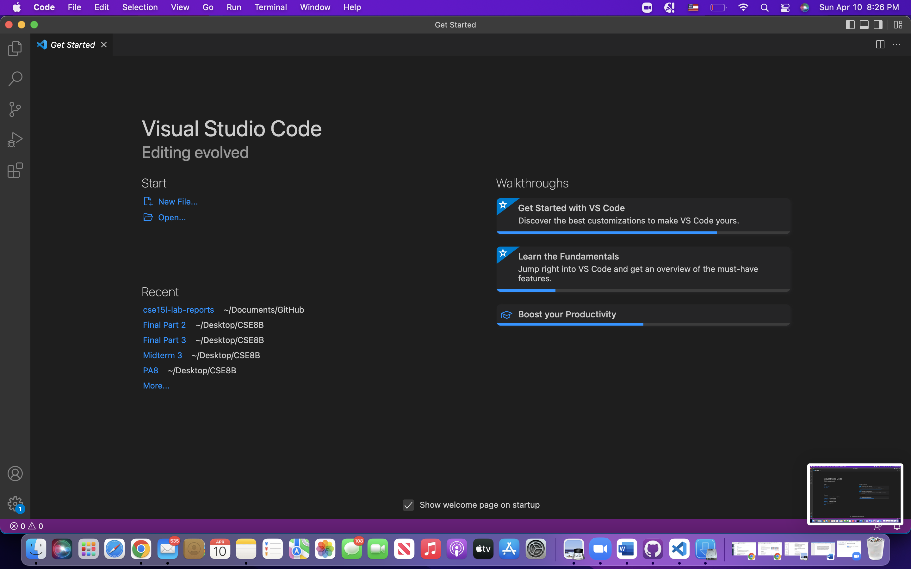
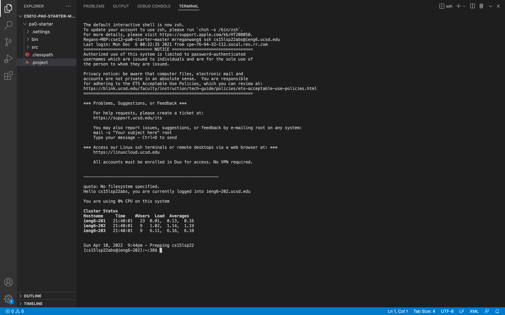
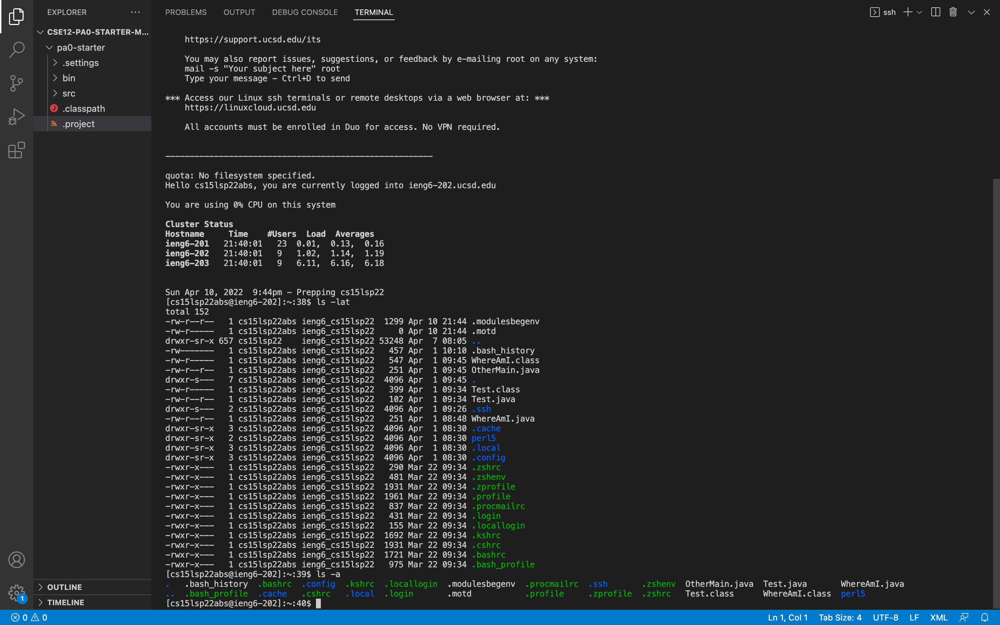
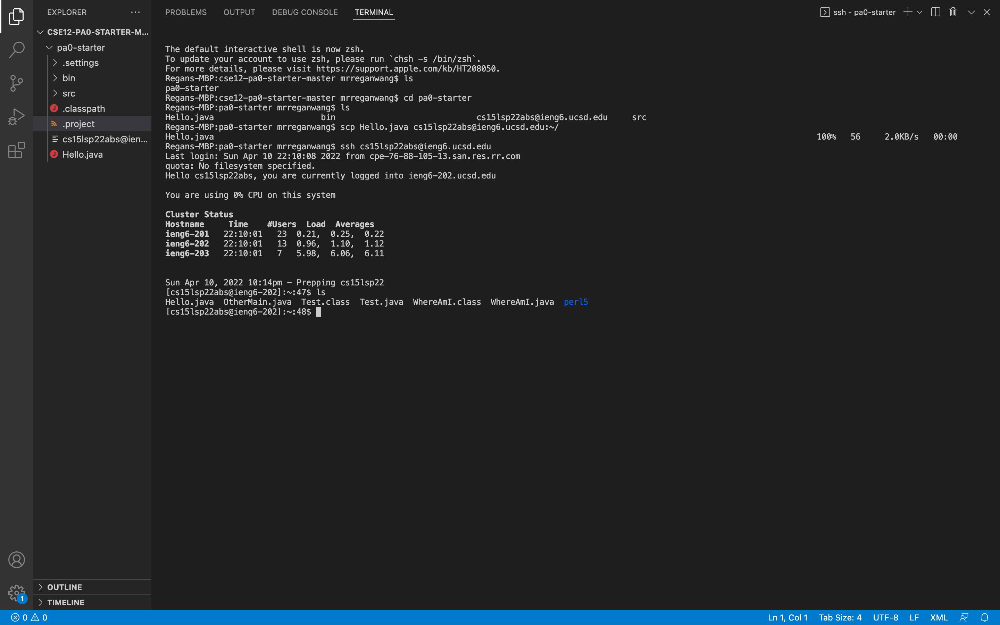
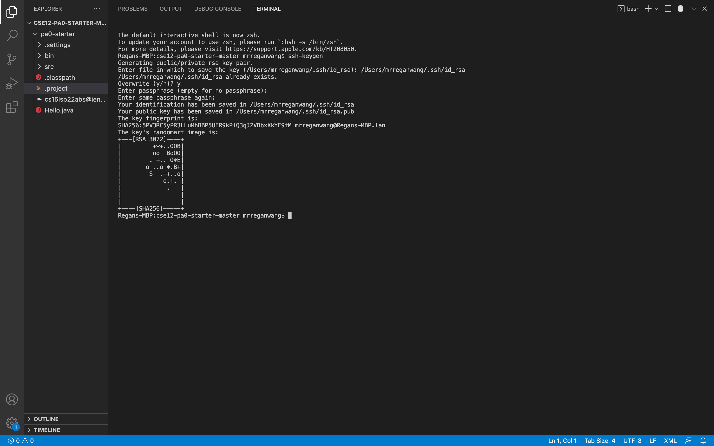
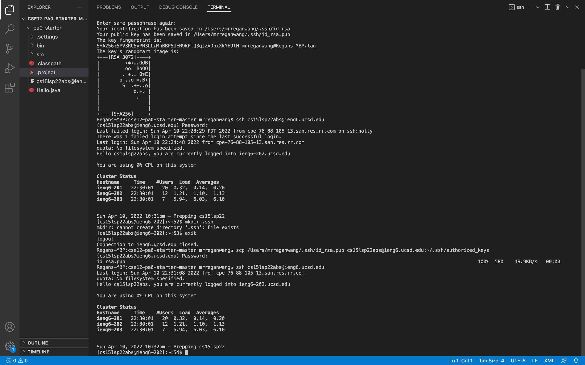

# REMOTE ACCESS for CSE15L

In this blog, you'll learn about 6 things to help you access a remote computer. These 6 things are: 
1. Installing VScode
2. Remotely Connecting
3. Trying Some Commands
4. Moving Files with `scp`
5. Setting an SSD Key
6. Optimizing Remote Running

## 1. Installing VScode
Download VScode on their website [here](https://code.visualstudio.com/)

Once installed, open up VScode. The program should look like this: 



## 2. Remotely Connecting
In this step, you'll connect to a remote computer using SSH

First, if you're using a Windows computer, install OpenSSH following the instruction [here](https://docs.microsoft.com/en-us/windows-server/administration/openssh/openssh_install_firstuse). If you're on other OS, skip to the next step. 

Second, Open a new terminal in VScode(Ctrl + `, or use Terminal --> New Terminal menu option). Then, type in the command: 
 
```
ssh cs15lsp22zzz@ieng6.ucsd.edu
```
If it's the first time you're connecting to the server, the following message will pop up.

```
The authenticity of host 'ieng.ucsd.edu (128.54.70.227)' can't be established.

RSA key fingerprint is 
SHA256:ksruYwhnYH+sySHnHAtLUHngrPEyZTD1/1x99wUQcec.

Are you sure you want to continue connecting
(yes/no/[fingerprint])?
```
Type in `yes` then enter your password to connect your terminal to a remote computer. If you've successfully connect to the remote computer your terminal should look something like this:


# 3. Trying some Commands
Here are some commands to try once you've connected to a remote computer. 
- `cd~` changes directory to your home directory
- `cd` changes directory
- `ls -lat` shows detailed file info
- `ls -a` shows the files in the directory
- `ls /home/linux/ieng6/cs15lsp22/cs15lsp22abc` where abc is other members' username. shows the files in their directory
- `cp /home/linux/ieng6/cs15lsp22/public/hello.txt ~/` copies a file (hello.txt in this example)
- `cat /home/linux/ieng6/cs15lsp22/public/hello.txt` displays the content of the file (hello.txt in this example)

Below is an example of the `ls -lat` and `ls -a` command: 


When you're finished using the remote computer. Type in the command `exit` to log out of that computer. 

# 4. Moving Files with `scp`
You can move a file from your local computer to the remote computer using the command: 
```
scp fileName.java sc15lsp22zz@ieng6.ucsd.edu
```
You should replace "fileName.java" with the name of the file you want to move to the remote computer and "zz" with your username. 

After running the command you'll need to enter your password again. 
You can use the `ls` command from earlier to check whether your file has successfully been copied to the remote computer. Also, you can use `java` and `javac` to run or compile your file on the remote computer the same way you run or compile the file on your local computer. 

Below is an example of "Hello.java" being copied from a local computer to a remote computer. 


# 5. SSH Keys
Having to type in your password everytime can be quite cumbersome. One way to avoid typing in your password everytime is to generate public and private keys to help connect your computer to the remote computer. To do this, type in the command: 
```
ssh-keygen
```
Below is what shows up in your terminal. You've now saved the private key in your local computer


Once you've saved the private key to your local computer, you need to save you public key to the .ssh account on your remote server following these steps:
1. log onto your remote computer and make a new directory using the command 
```
mkdir.ssh
```
2. log out and save the public key you've created earlier onto your remote computer using the command:
```
scp /Users/<user-name>/.ssh/id_rsa.pub cs15lsp22zz@ieng6.ucsd.edu:~/.ssh/authorized_keys
```
3. You should now be able to log onto your remote computer without having to enter your password everytime

Here's an example of the entire process.


# 6. Making Remote Running Even More Pleasant
Here are some commands that allow you to run your remote computer without logging in. 
```
ssh cs15lsp22zz@ieng6.ucsd.edu "ls"
```
- The above commad allow you to view the files on your remote directory without having to log on.

```
cp WhereAmI.java OtherMain.java; javac OtherMain.java; java WhereAmI
```
- Using the semicolon, you can run multiple commands on the same line
-  You can also use the up arrow to recall the last command that was run


