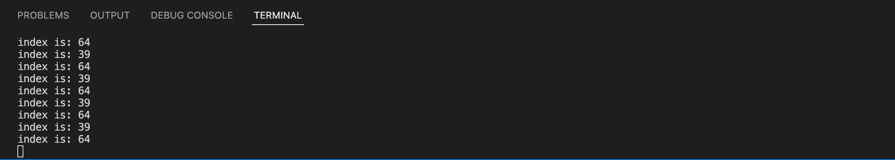
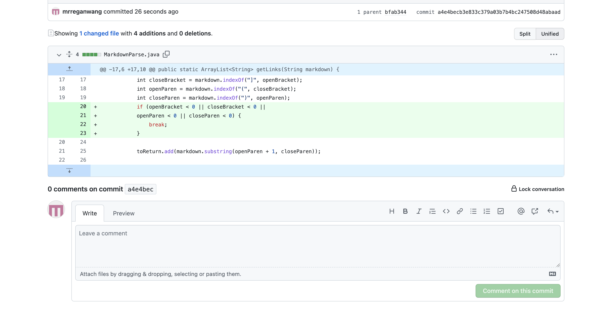
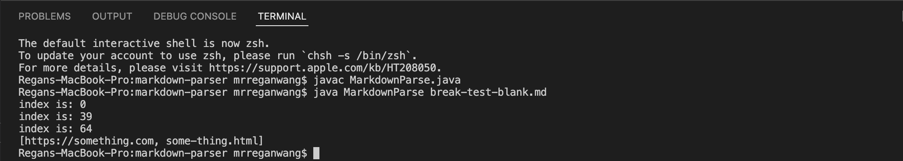

## Debugging

In lab 3, we encountered bugs when running our getLinks method in MarkdownParse.java. Therefore, we made changes to the method to resolve these issues. Here are the changes we made to the method. 

## 1. 

If the [file to read](https://github.com/mrreganwang/markdown-parser/blob/main/break-test-blank.md?plain=1) has an empty line in the end, it'll create an infinite loop like this.

Here is the changes we made to fix the issue:

And here is the result:

The bug in the original getLink method is that nowhere in the code did it account for the case when there is an empty line, therefore the while loop never ends. That's why the symptom shows an infinite loop when our file has an empty line in the end.