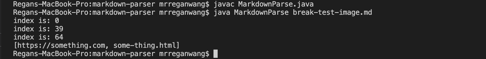
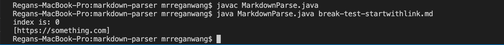

## Debugging

In lab 3, we encountered bugs when running our getLinks method in MarkdownParse.java. Therefore, we made changes to the method to resolve these issues. Here are the changes we made to the method. 

## 1. 

If the [file to read](https://github.com/mrreganwang/markdown-parser/blob/main/break-test-blank.md?plain=1) has an empty line in the end, it'll create an infinite loop like this.

Here are the changes we made to fix the issue:

And here is the result:

The bug in the original getLink method is that nowhere in the code did it account for the case when there is an empty line, therefore the while loop never ends. That's why the symptom shows an infinite loop when our file has an empty line in the end.

## 2. 

If the [file to read](https://github.com/mrreganwang/markdown-parser/blob/main/break-test-image.md) contains an image, it'll copy down the link/file name to the image as well. Heres what it looks like:

Here are the changes we made to fix the issue:

And here is the result:

The bug in the original getLink method is that the code doesn't account for images because the command for images in markdown only has 1 extra exclamation point compared to the command for links. That's why the symptom shows that the link or the filename of the image was included in the list of links. 

## 3. 
If the [file to read](https://github.com/mrreganwang/markdown-parser/blob/main/break-test-startwithlink.md) starts with a link it'll create an error of array out of bounds because the way we fixed the last error was to change if the index before the bracket was an explanation point. If the file starts with a square bracket, there cannot be an idnex of -1. Heres what it looks like:

Here are the changes we made to fix the issue:

And here is the result:

The bug in the original getLink method is that the code doesn't account for the situation where the file starts with the link. Therefore, we'll get an index of of bounds because to fix issue 2 we added an if statement to search for the exclamation mark before the open bracket. That's why the symptom shows StringIndexOutOfBoundsException when we call the method. 

