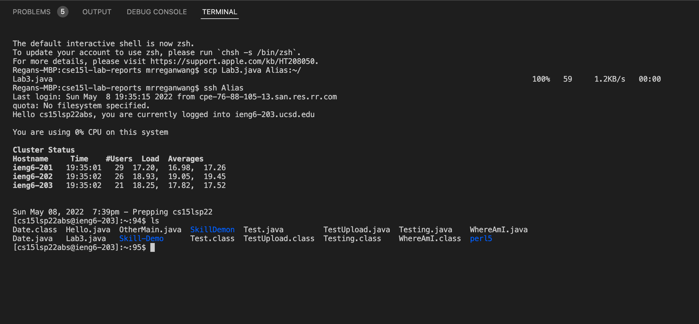
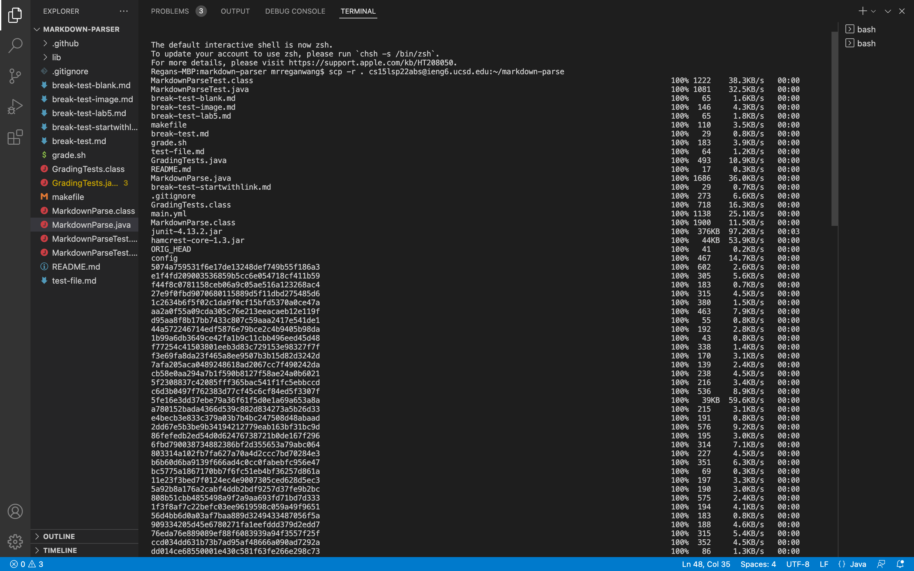
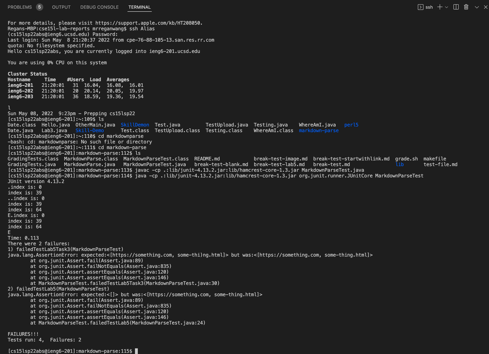

## Lab Report 3

## Streamlining SSH Configuration
Having to type a long command to log onto the remote server can be cumbersome. We can make the process a bit easier. 

First open up the config file under .ssh/ directory. 
Then, add these lines to the file. 
```
Host ieng6
    HostName ieng6.ucsd.edu
    User cs15lsp22zzz (use your username)
    IdentityFile ~/.ssh/id_rsa

```
Here's an example of it being ran in TextEdit for mac. 


Note that in this example, the name after "host" is just an alias, you can change it to whatever name you want. 

Then, you can log onto your remote server using 
```
ssh ieng6
```
Again, the "ieng6" here can be replaced by your own alias. 

Now, the scp command from lab report 1 can be run using the alias for easier transfer of file. 

Here's an example of the log in and file transfer


## Setup Github Access from ieng6


## Copy whole directories with scp -r
To copy a directory takes a bit more than just the `scp` command. We have to copy the files recursively. Here's an example of me copying my MarkdownParse directory to my remote server. 


Here is me running the tests remotely



