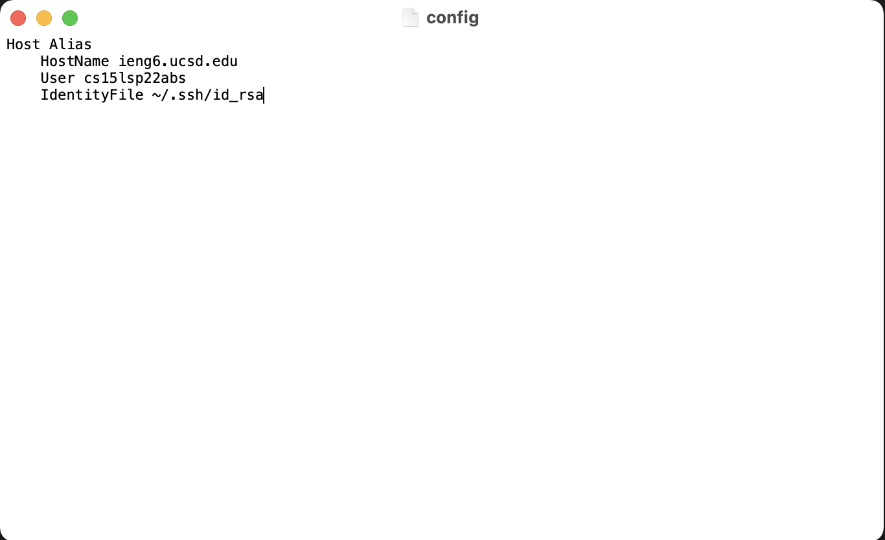

## Lab Report 3

## Streamlining SSH Configuration
Having to type a long command to log onto the remote server can be cumbersome. We can make the process a bit easier. 

First open up the config file under .ssh/ directory. 
Then, add these lines to the file. 
```
Host ieng6
    HostName ieng6.ucsd.edu
    User cs15lsp22zzz (use your username)
    IdentityFile ~/.ssh/id_rsa

```
Here's an example of it being ran in TextEdit on mac. 



Note that in this example, the name after "host" is just an alias, you can change it to whatever name you want. I've decided to use the name "Alias" for my examples. 

Then, you can log onto your remote server using 
```
ssh ieng6
```
Again, the "ieng6" here can be replaced by your own alias. Here's an example of me logging onto my remote account using the above command. 


Now, the scp command from lab report 1 can be ran using the alias for easier transfer of file. Check section 4 from [lab report 1](https://mrreganwang.github.io/cse15l-lab-reports/lab-report-1-week-2) for info on scp command. 

Here's an example of the file transfer


## Setup Github Access from ieng6


## Copy whole directories with scp -r
To copy a directory takes a bit more than just the `scp` command. We have to copy the files recursively. Here's an example of me copying my MarkdownParse directory to my remote server. 


Here is me running the tests remotely


Using what we've learned from lab report 1, the process of copying the directing, compiling the test, and running test can be done in single step. Here's an example


