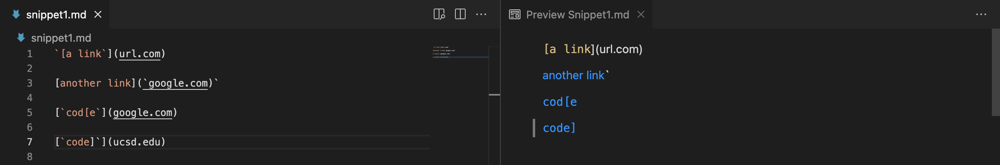
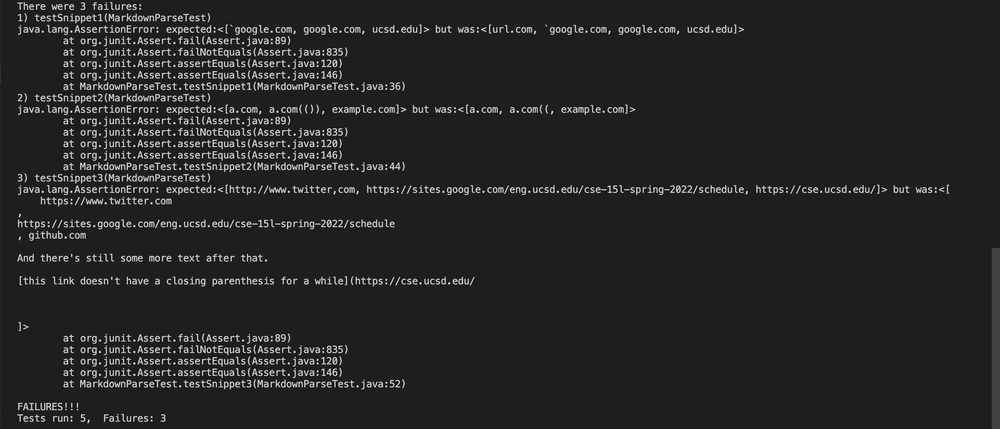

## Week 8 Lab Report 4

For this lab report, we will run tests on some test files. Here are the 3 test files and their expected output from VScode preview. 

1. Snippet 1

2. Snippet 2

3. Snippet 3

We will run tests on [our implementation of markdown-parse](https://github.com/mrreganwang/markdown-parser) and [implementation from other group](https://github.com/Luke-Sheltraw/markdown-parser/)

Here are the tests we'll be running on both implementations:

And here are the results    

our implementation:

other group's implementation:

