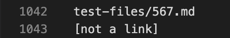
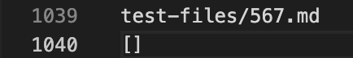
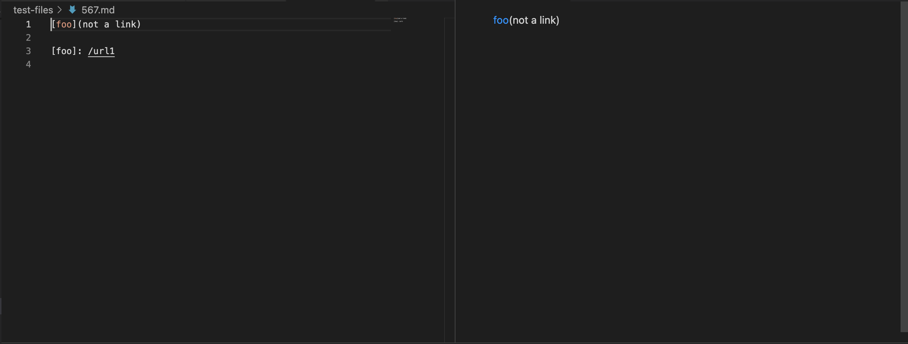
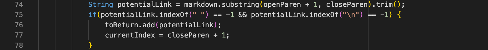
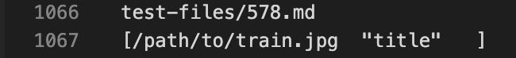
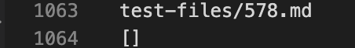
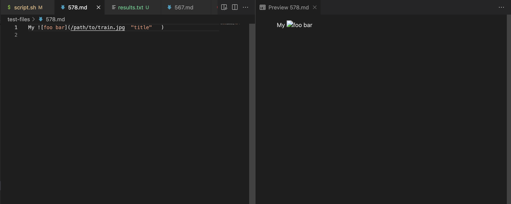
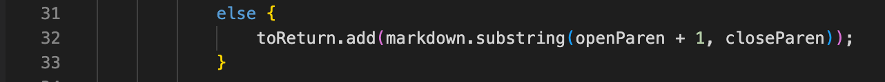

## Week 10 Lab Report 5

We found the difference in output manually by searching through the results 
for the implementation from lab 9 and our implementation. 

We chose testfile [567](https://github.com/nidhidhamnani/markdown-parser/blob/main/test-files/567.md) and [578](https://github.com/nidhidhamnani/markdown-parser/blob/main/test-files/578.md). 

For 567:
Here is the output from our implementation

Here is the output from lab9's implementation


The expected output should be 
```
test-files/567.md
[not a link]
```

Our implementation is correct as we can see from the markdown preview screenshots below


The problem with the implementation from lab 9's implementation is that it checks whether there are spaces inside the link which in this case there is (even though the link is not valid markdown still view it as a link).
This is where it causes an error


For 578:
Here is the output from our implementation

Here is the output from lab9's implementation


The expected output should be
```
[]
```

Lab 9's implementation is correct as we can see from the markdown preview screenshot below


The problem with the implementation from our markdown-parser is that we have an extra else statement that just adds the substring within the open and closed parenthesis without setting the condition. We should've checked if the index before the open bracket is an exclamation mark or not since it would print an image rather than a link. 
Here is where we should've specified the condition

instead of else it should've been else if(...). 